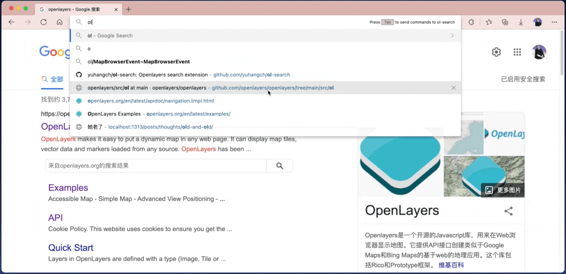

# ol search 🚧
a browser extension that help you access *openlayers* api doc with autocomplete quickly.

## Install
### from store
🙈 *TODO*
### from source
```shell
git clone https://github.com/yuhangch/ol-search.git
cd ol-search 
yarn build
```
## Use
> `OL Search` will open a new tab on installed to load index data.
1. Enter the keyword `ol` in the browser address bar.
2. Press `Tab` enter ol search.
3. Enter the keywords e.g. "map".

## Support 
**Chrome/Edge**, due to manifest v3 current not works on Firefox.

## Roadmap
- Support Firefox.
- Install from store.
- Improve query result.

## License
[Apache License](LICENCE)
